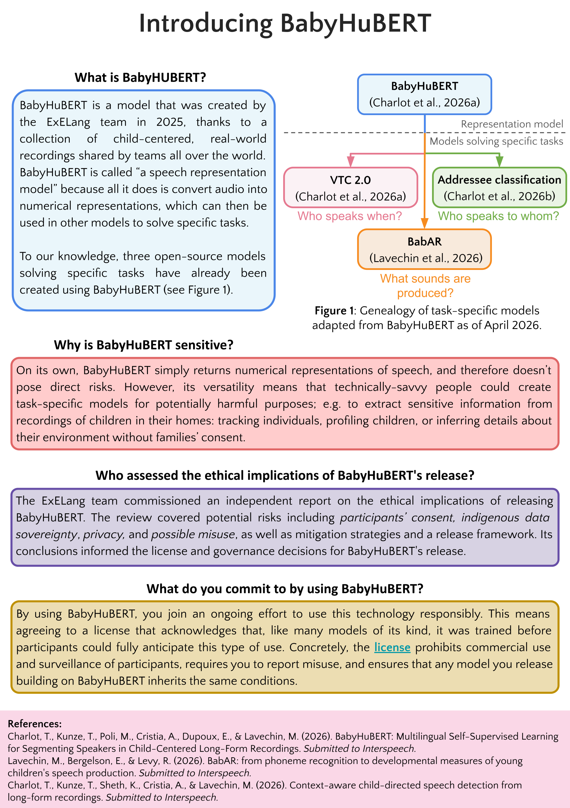

# BabyHuBERT

BabyHuBERT is an audio encoder model trained by reconstructing multilingual child-centered long-form audio recordings. From the raw audios of longform recordings, the model extracts richer representations than usual models trained on clean, well spelled speech. You don't usually use a model as is, you fine-tune the pretrained model to a specific task.




## What BabyHuBERT is *not*

- **Not the voice type classifier** — it extracts from raw audios representations that can be used for voice type segmentation. To extract voice type segments refer to [VTC2.0](../index.md).

## What BabyHuBERT *is*

!!! tip "tdlr"
    HuBERT model trained over 40 languages on 13 000 hours of speech from child-centered long-form audio recordings

### Description
A long detailed description here

### Advanced description
A long advanced description here for Machine Learners

## Ethics statement
!!! warning "Ethics surrounding BabyHuBERT data"
If you wish to use BabyHuBERT please read the ethics statement below

Statement below

## Derived models

| Model | Task |
|------|------|
| [VTC2.0](../index.md) | Voice Type Classification |


## How to access model
1. Read the Ethics statement
2. Go on the BabyHuBERT repo : [coml/BabyHuBERT](assets/BabyHuBERT_onepager.png)
3. Fill the required fields and accept the license
4. Download the model

## How to cite
```bibtex
@misc{charlot2026babyhubertmultilingualselfsupervisedlearning,
    title={BabyHuBERT: Multilingual Self-Supervised Learning for Segmenting Speakers in Child-Centered Long-Form Recordings}, 
    author={Théo Charlot and Tarek Kunze and Maxime Poli and Alejandrina Cristia and Emmanuel Dupoux and Marvin Lavechin},
    year={2026},
    eprint={2509.15001},
    archivePrefix={arXiv},
    primaryClass={eess.AS},
    url={https://arxiv.org/abs/2509.15001}, 
}
```